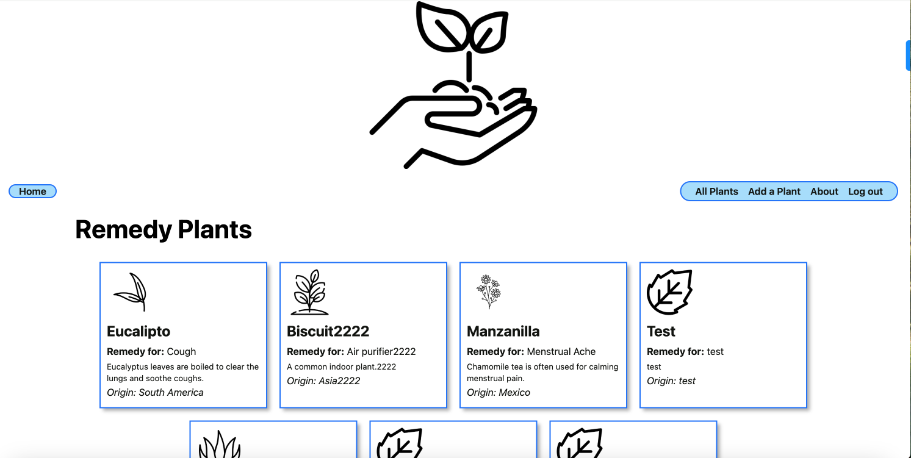
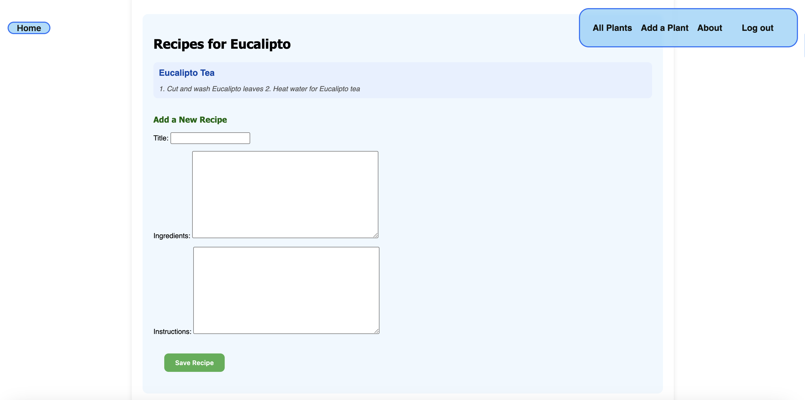
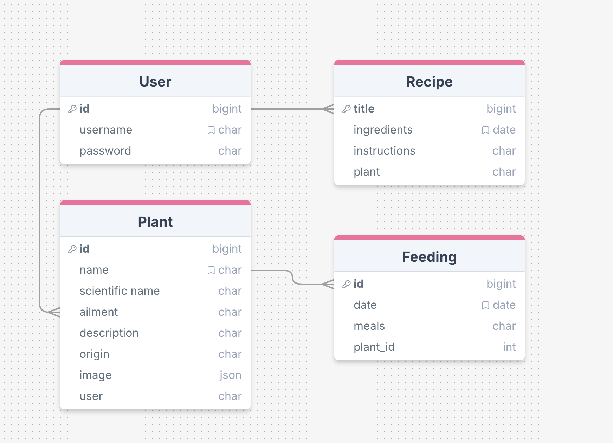

# plant-remedies
A Plant + Healing Recipes App


# Plant Remedies

A full-stack web application that allows users to document their home remedies and manage them in a personalized dashboard. Users can create, view, update, and delete plant remedies, as well as leave recipes on individual remedies.

What problem it solves:

One place to keep remedies past down to generations.  The idea is to document and share traditional knowledge in a modern, organized way.


<!-- 🔗 TODO: add link to deployed site-->
🔗 **Check out the Application [Here](https://)**


 

---
)


## Tech Stack

- **Frontend**: Python
- **Backend**: Python, Django
- **Deployment**:
  - Frontend: [Heroku Pages](https://www.heroku.com/)
  - Backend: [Netlify](https://www.netlify.com/)

---

## Key Features

- View a list of your plant remedies
- Edit or delete existing plant remedies
- Add recipes to each plant

---

## ERD
)

---

## Project Links

| Resource            | Link |
|---------------------|------|
| **Trello Board**     | [View Trello Board](https://https://trello.com/b/Xjzyzbdn/plant-remedies-project-4) |
<!-- | **Deployed App**     | [View Deployed App](https://trimlinc.netlify.app/) | -->

---

## Clone This Repo

To clone and navigate into the code:

```bash
git clone https://github.com/paintedlbird7/plant-remedies && cd plant-remedies
```


## Next Steps

- Ability to delete and edit a recipe

## Frameworks & Libraries

- **Python** – Frontend framework
- **Django** – Database
- **CSS** – For styling
- **Assets**  - https://www.flaticon.com/search?word=plant

## Contributors

- **Rosa Perez** – [GitHub](https://github.com/paintedlbird7)
